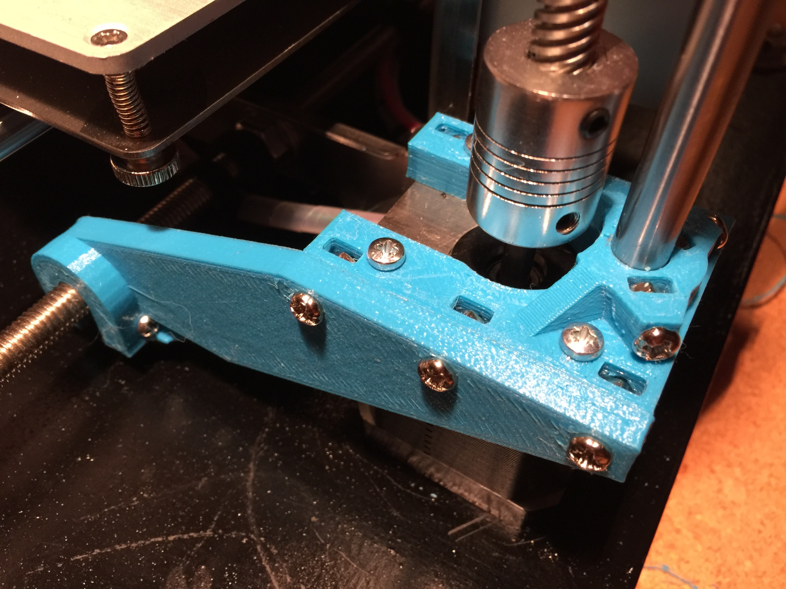
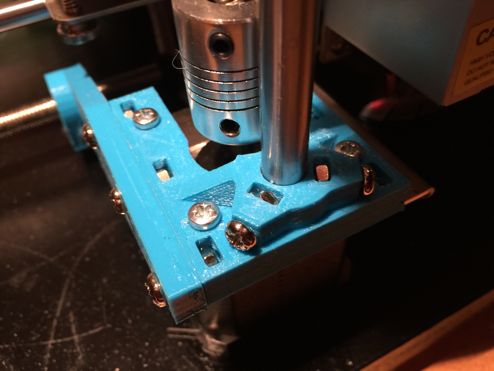
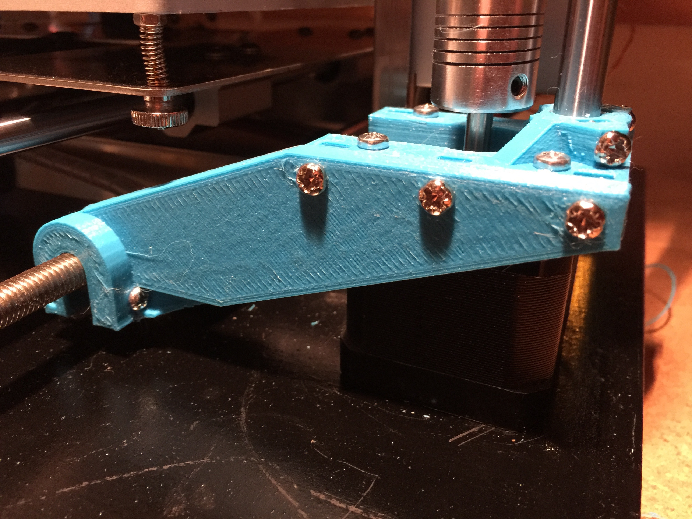

# Zonestar P802Q Bracing

This repository includes a number of parts which are designed to improve the bracing of the [Zonestar P802Q/P802QA](http://www.aliexpress.com/item/full-Metal-Reprap-Prusa-i3-3d-Printer-DIY-kit-Stainless-Steel-Easy-Installation-2-Roll-Filament/32586716087.html?spm=2114.40010308.4.2.iW3265) 3D printer.

## Motivation

This printer is inexpensive and generally well built but the frame is too thin and flexes too much. These parts are designed to assist with adding rigidity and holding the frame in alignment.

## Parts Required

- 8x M3x15 bolts for stepper motors.
- 12x M3 nuts.
- 2x M3x25 bolts for z-axis supports.

## Instructions

### Z-axis Platform

The Z-axis platform supports the Z-axis rod and provides better alignment for the Z-axis stepper motor. Before performing this procedure, ensure the Z-axis rods are parallel and vertical by adjusting the X-axis bars inwards or outwards. This is critical for the stability of the Z-axis.

1. Print out the Z-axis platform parts x2.
2. Remove existing Z-axis stepper motor screws.
3. Undo the smooth Z-axis rods.
4. Pull the rods forward gently at the top and slide up, then down into the platform.
5. Push a little bit below the bottom of the platform, and then fit into the steel frame.
6. Screw the platform into the stepper motor.
7. Add nuts to z-axis support, and loosely screw in M3x10 bolts ("lug nuts").
8. Screw in the z-axis rod at the top.
9. While pushing down on the z-axis rod, secure the "lug nuts".

### Front Support

The front support bolts on to the z-axis platform and provides more rigidity when printing at higher speeds or using Z-lift. The stepper motors have quite high torque and will rotate the frame of the printer slightly, giving an error on the Y axis. The front support should help to minimise/distribute this twist.

1. Print out the front support parts x2 (one needs to be mirrored!).
2. Add three nuts to the Z-axis platform and use M3x10 bolts to attach the front support to the z-axis platform.
3. Insert and push back a nut into the end of the front support.
4. Rotate the platform so that it slots on to the M8 threaded bar along the bottom of the printer.
5. Ensure that the M8 bar rests comfortably into the top of the support - it should be level - if not something is wrong with your frame.
6. Insert a M3x25 bolt into the side of the front support and loosely screw it in.
7. While pushing down on the front support, tighten it up until you begin to see the U hook flex/bend slightly. This should be enough to hold everything in place.

## Contributing

1. Fork it
2. Create your feature branch (`git checkout -b my-new-feature`)
3. Commit your changes (`git commit -am 'Add some feature'`)
4. Push to the branch (`git push origin my-new-feature`)
5. Create new Pull Request

## License

Released under the MIT license.

Copyright, 2016, by [Samuel G. D. Williams](http://www.codeotaku.com/samuel-williams).

Permission is hereby granted, free of charge, to any person obtaining a copy of this software and associated documentation files (the "Software"), to deal in the Software without restriction, including without limitation the rights to use, copy, modify, merge, publish, distribute, sublicense, and/or sell copies of the Software, and to permit persons to whom the Software is furnished to do so, subject to the following conditions:

The above copyright notice and this permission notice shall be included in all copies or substantial portions of the Software.

THE SOFTWARE IS PROVIDED "AS IS", WITHOUT WARRANTY OF ANY KIND, EXPRESS OR IMPLIED, INCLUDING BUT NOT LIMITED TO THE WARRANTIES OF MERCHANTABILITY, FITNESS FOR A PARTICULAR PURPOSE AND NONINFRINGEMENT. IN NO EVENT SHALL THE AUTHORS OR COPYRIGHT HOLDERS BE LIABLE FOR ANY CLAIM, DAMAGES OR OTHER LIABILITY, WHETHER IN AN ACTION OF CONTRACT, TORT OR OTHERWISE, ARISING FROM, OUT OF OR IN CONNECTION WITH THE SOFTWARE OR THE USE OR OTHER DEALINGS IN THE SOFTWARE.